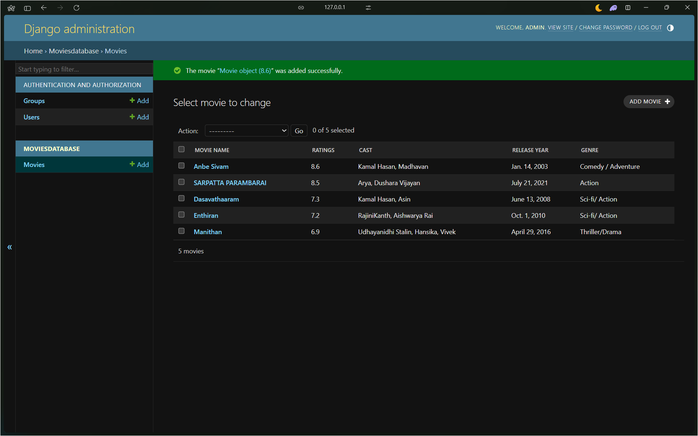

# Ex02 Django ORM Web Application
## Date: 22-04-2025

## AIM
To develop a Django application to store and retrieve data from Movies Database using Object Relational Mapping(ORM).

## ENTITY RELATIONSHIP DIAGRAM


## DESIGN STEPS

### STEP 1:
Clone the problem from GitHub

### STEP 2:
Create a new app in Django project

### STEP 3:
Enter the code for admin.py and models.py

### STEP 4:
Execute Django admin and create details for 10 books

## PROGRAM
### Develoed by : **NARESH S**
### Reg no : **212224240101**
### admin.py
```python
from django.contrib import admin
from .models import Movie,MovieAdmin
admin.site.register(Movie,MovieAdmin)
```
### models.py
```python
from django.db import models
from django.contrib import admin
class Movie(models.Model):
	Movie_name=models.CharField(max_length=50)
	Ratings=models.FloatField(primary_key="Ratings")
	Cast=models.CharField(max_length=50)
	Release_year=models.DateField()
	Genre=models.CharField(max_length=50)
class MovieAdmin(admin.ModelAdmin):
	list_display=('Movie_name','Ratings','Cast','Release_year','Genre')
```


## OUTPUT



## RESULT
Thus the program for creating a database using ORM hass been executed successfully
